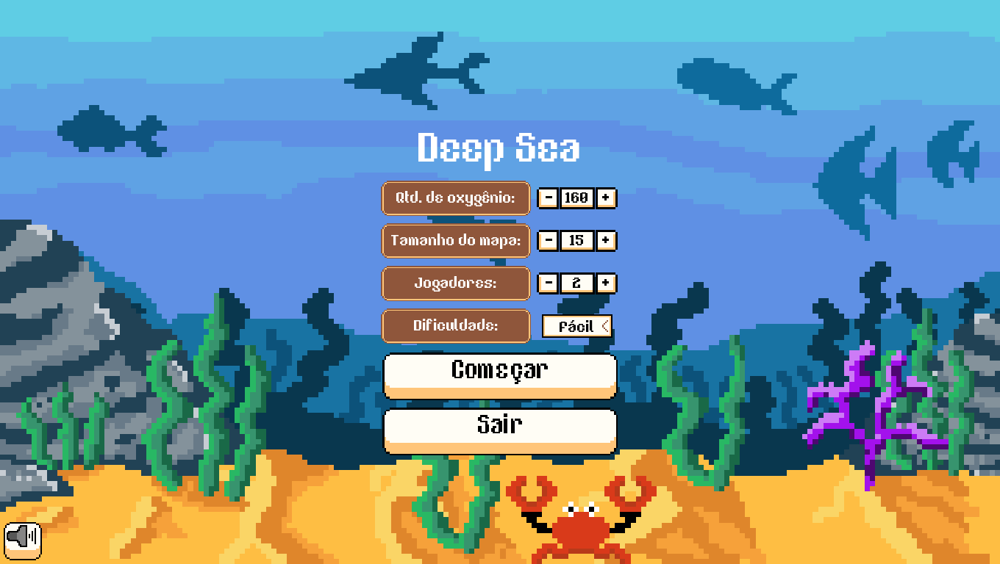
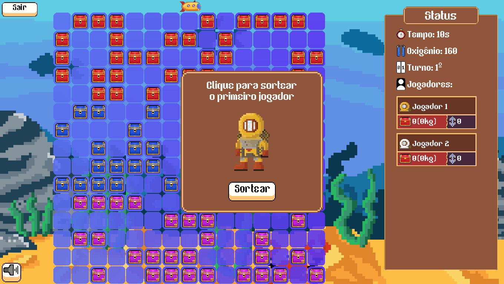
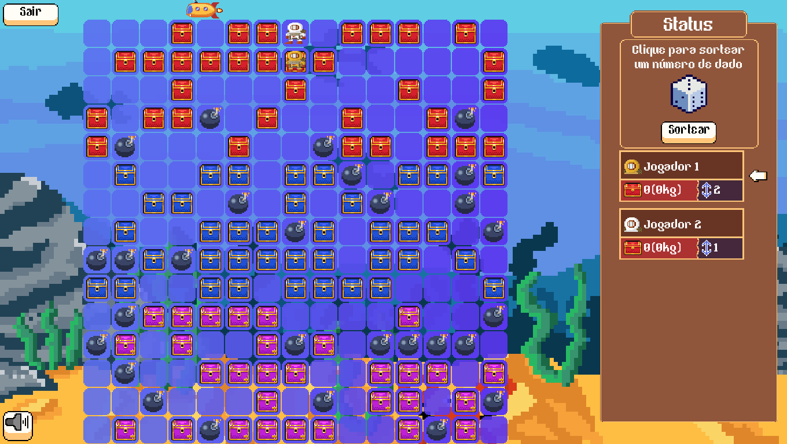

# Deep Sea

Um jogo feito em PyGame para o curso de Python ofertado pelo curso de Engenharia da Computação da UEFS.

Funcionalidades:
- [x] Arte própria (Feita com o Aseprite), fonte e trilha sonora Royalty-Free e efeitos de interação com a UI
- [x] UI Kit próprio
- [x] Sistema de cenas para gerenciar os estados do jogo
- [x] Tela de início com configurações do jogo
- [x] Geração do mapa
- [x] População das células do mapa com tesouros e bombas de acordo com a dificuldade
- [x] Gerenciamento de turno de cada jogador
- [x] Coleta de tesouros 
- [x] Gasto de oxigênio geral de acordo com o peso de cada jogador mergulhado
- [x] Verificação das condições de um possível ganhador da partida (ainda falta a correção de bugs para alguns casos)
- [ ] Pausar a música quando sair da tela do jogo e despausar ao voltar
- [ ] Respeitar o sistema de mutar a música entre a tela de configuração e jogo (atualmente é necessário mutar separadamente)
- [ ] Permitir a volta para tela inicial do jogo após terminar uma partida
- [ ] Adicionar mais comentários para descrever algumas funções
- [ ] Resolver os TODO's especificados no código
- [ ] Criar uma logo para o jogo

## Imagens do jogo:

#### Tela de início:

#### Tela de sorteamento de jogador:

#### Tela durante o jogo:
